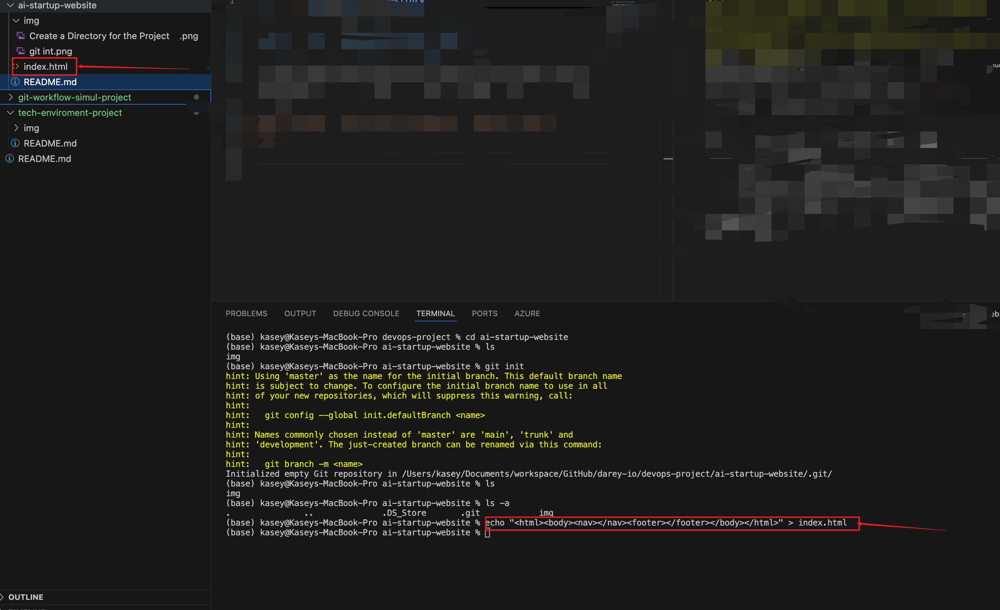

# Git Workflow Simulation: Tom and Jerry (Navigation and Contact Info)

This mini-project will guide you step-by-step to replicate their collaborative workflow, including setting up a repository, creating branches, making changes, resolving conflicts, and merging work.

# Step-by-Step Simulation
## Step 1: Set Up the Project Repository
Let’s simulate the central repository locally on your machine.

## 1. Create a Directory for the Project:
- Open your terminal and run:
`mkdir ai-startup-website` then
`cd ai-startup-website`

## 2. Initialize a Git Repository

- Initialize a new Git repository to simulate the central repo by running git init on your bash  terminal:

`git init`

## 3. Create the Initial index.html File

- Create a basic index.html file to represent the starting point of the project. In your terminal (NOTE: I am currently using VScode for this preject), use any text editor or this command to create it:

`echo "<html><body><nav></nav><footer></footer></body></html>" > index.html`

## 4. Stage and Commit the Initial File

- Add the file to Git and commit it to the main branch

`git add .`

then 

`git commit -m "Initial commit for all working directory"`

## Step 2: Simulate Tom and Jerry Cloning the Repository
In a real scenario, Tom and Jerry would clone the repo from a remote server (e.g., GitHub). For simplicity, we’ll simulate their local workspaces within the same directory by working with branches.

## Step 3: Tom Starts Working (Branch: update-navigation)

## 1. Create and Switch to Tom’s Branch

 Type `git checkout -b update-navigation` on your terminal to create a new branch for Tom and switch

 

 Enter `git branch` to verify it was created and switched to Tom branch

 

 ## 2. Edit index.html to Update Navigation

Open index.html in your text editor and modify the `<nav>` section, e.g.:
`<html><body><nav><ul><li>Home</li><li>About Us</li><li>Services</li><li>Contact</li></ul></nav><footer></footer></body></html>`

-  Open the file in a browers to verify the added text is in the index.html file

## 3. Commit Tom’s Changes

`git add .`

then type 

`git commit -m "Updated navigation bar"`

## Step 4: Jerry Starts Working (Branch: add-contact-info)

 ## 1. Switch Back to main and Create Jerry’s Branch

Enter `git checkout main` or `master` to switch to main or master branch

## Create Jerry’s Branch and Switch to the branch

Enter `git checkout -b add-contact-info`

## 2. Edit index.html to Add Contact Info

Open index.html and modify the `<footer>` section, e.g.:

`<html><body><nav></nav><footer>
Contact us: info@aistartup.com
</footer></body></html>`

## 3. Commit Jerry’s Changes

`git add .` then enter
`git commit -m "Added contact info to footer"`

## Step 5: Merge Tom’s Changes into main or Master
 

 ## 1. Switch to `main` or m`aster`

Enter `git checkout main` or `master` on your terminal

## 2. Merge Tom’s Branch

Merge Tom’s `update-navigation` branch into `main` or `master`

Enter `git merge update-navigation` on your terminal

Since there are no conflicts yet (Jerry’s changes are still in his branch), this merge will succeed. The index.html in main now has Tom’s updated navigation.

## Step 6: Jerry Updates His Branch and Resolves Conflicts

## 1. Switch to Jerry’s Branch

Enter `git checkout add-contact-info` on your terminal

## 2. Pull in Changes from main or master

 Update Jerry’s branch with the latest main or master:

Enter `git merge main` or `master`

Git may detect a conflict because both Tom and Jerry modified index.html. If a conflict occurs, Git will mark it in the file. Open index.html, and you might see something like:

## 3. Resolve the Conflict

Edit index.html to combine Tom’s and Jerry’s changes, e.g.:

`<html><body><nav><ul><li>Home</li><li>About Us</li><li>Services</li><li>Contact</li></ul></nav><footer>
Contact us: info@aistartup.com
</footer></body></html>`

## Step 7: Merge Jerry’s Changes into main

 ## 1. Switch to main or master:

Enter `git checkout main` or `master`

## 2. Merge Jerry’s Branch:

Enter `git merge add-contact-info` on your terminal 

If the conflict was resolved correctly, this merge will succeed, and `index.html` in main will now contain both Tom’s navigation and Jerry’s contact info.

## Step 8: Verify the Final Result

Check the final `index.html` on your browser or terminal using 

`cat index.html`  # On macOS/Linux

You should see the combined changes:

# Conclusion
Through this simulation, you’ve:
- Initialized a Git repository.

- Created branches for Tom and Jerry to work concurrently.

- Made changes to the same file (index.html) in separate branches.

- Merged changes into main, resolving a conflict along the way.

This hands-on exercise demonstrates why VCS like Git is essential: it prevents overwriting, tracks changes, and enables seamless collaboration. You can extend this by adding more files or team members, or pushing the repo to a remote service like GitHub for a more realistic setup.

# SECTION 2 
# Pushing the repo to a remote service like GitHub

## Create a New Repository on GitHub

## 1. Log in to GitHub

- Open your browser, go to `github.com`, and sign in.
Also make sure youre signin to your VScode with your GitHub Account or your terminal is configure to login your Github Account remotely
## 2. Push to the GitHub Repository

- Push the updated repo with the new folder

`git push origin main`

